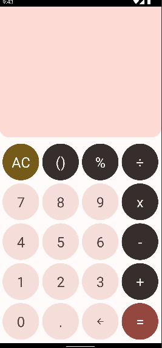
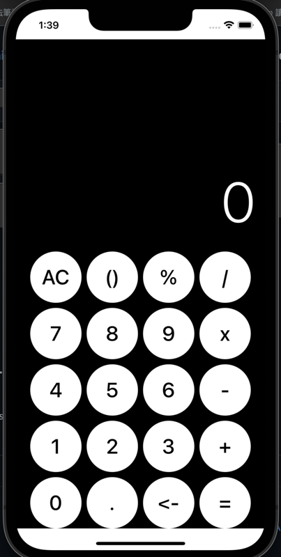

# KMMCalculator

A sample demonstrate a basic architecture and implement of Kotlin multiplatform mobile.

Android part implement Material 3 component, dynamic color system with wall paper.
IOS part implement black white style.

## folder structure

### shared module structure
.
├── androidMain
├── androidTest
├── commonMain
│        └── kotlin/com/kenny/aicalculator/domain
│                ├── CalculatorAction.kt
│                ├── ExpressionEvaluator.kt
│                ├── ExpressionParser.kt
│                ├── ExpressionPart.kt
│                ├── ExpressionWriter.kt
│                └── Operation.kt
├── commonTest
├── iosMain
└── iosTest

## shared class and logic explained
### CalculatorAction
Encapsulate basic action with calculator action, including Number, Operation, Clear, Delete, Parentheses, Calculate, Decimal.

### ExpressionEvaluator
Validate input is one the following format
- expression :	term | term + term | term − term 
- term :  factor | factor * factor | factor / factor | factor % factor 
- factor : 	number | ( expression ) | + factor | − factor

### ExpressionParser
Parsing expression into operation, number or parentheses.

### ExpressionPart
Encapsulate expression parse type and parentheses type. 

### ExpressionWriter
Writer only allow valid format. 

### Operation
Encapsulate basic math operation.